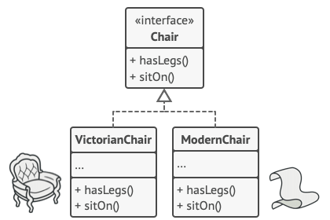
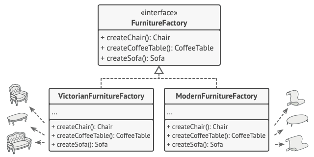
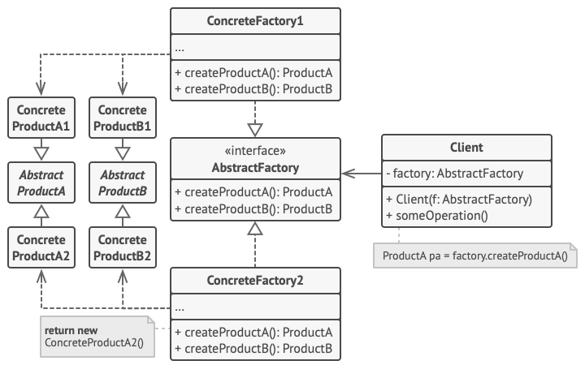

## Definition
Abstract Factory is a creational design pattern that lets you produce families of related objects without specifying their concrete classes.

Link: https://refactoring.guru/design-patterns/abstract-factory

## Problem
Imagine that you’re creating a furniture shop simulator. Your code consists of classes that represent:

A family of related products, say: `Chair` + `Sofa` + `CoffeeTable`.

Several variants of this family. For example, products `Chair` + `Sofa` + `CoffeeTable` are available in these variants: `Modern`, `Victorian`, `ArtDeco`.

## Solution
First step: All main types have their own interface and we can combine them

Second step: Create `Abstract Factory` interface (`createChair`, `createSofa` and `createCoffeeTable`)

End structure:

## Example in short:
- Create a factory that can give you: adidas/nike brand factory (struct)
- Create these two brands - with their set of creations that return the abstract products
- Create abstract products (shoe, shirt) - with their set of methods